&nbsp;

**Regulatory systems** — compliance automation, cross-framework reasoning  
**Security architecture** — hardened infrastructure, cryptographic identity, zero-trust  
**AI engineering** — holistic systems, evaluation at scale

&nbsp;

---

Luxembourg
